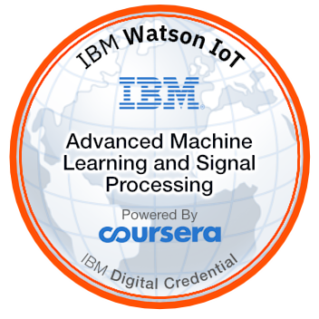

# Specialization : Advanced Data Science with IBM
## Course : Advanced Machine Learning and Signal Processing

This course, Advanced Machine Learning and Signal Processing, is part of the IBM Advanced Data Science Specialization which IBM is currently creating and gives you easy access to the invaluable insights into Supervised and Unsupervised Machine Learning Models used by experts in many field relevant disciplines. We’ll learn about the fundamentals of Linear Algebra to understand how machine learning modes work. Then we introduce the most popular Machine Learning Frameworks for python Scikit-Learn and SparkML. SparkML is making up the greatest portion of this course since scalability is key to address performance bottlenecks. We learn how to tune the models in parallel by evaluating hundreds of different parameter-combinations in parallel. We’ll continuously use a real-life example from IoT (Internet of Things), for exemplifying the different algorithms. For passing the course you are even required to create your own vibration sensor data using the accelerometer sensors in your smartphone. So you are actually working on a self-created, real dataset throughout the course.

 

This badge earner understands how machine learning works and can explain the difference between unsupervised and supervised machine learning. The earner is familiar with the usage of state-of-the-art machine learning frameworks and different feature engineering techniques like signal processing and dimension reduction. The individual can also apply their knowledge on different industry relevant tasks. Finally, they know how to scale the models on data parallel frameworks like Apache Spark.

[Coursera Certificate](https://www.coursera.org/account/accomplishments/records/Z5FXRNAV25Q6)

