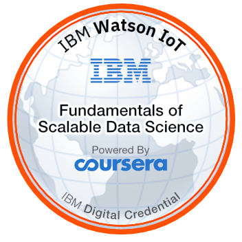

# Specialization : Advanced Data Science with IBM
## Course : Fundamentals of Scalable Data Science

This course teaches:
* Describe how basic statistical measures, are used to reveal  patterns within the data 
* Recognize data characteristics, patterns, trends, deviations or inconsistencies, and potential outliers.
* Identify useful techniques for working with big data such as dimension reduction and feature selection methods 
* Use advanced tools and charting libraries to:
  * improve efficiency of analysis of big-data with partitioning and parallel analysis 
  * Visualize the data in an number of 2D and 3D formats (Box Plot, Run Chart, Scatter Plot, Pareto Chart, and Multidimensional Scaling)

 

This badge earner has proven a deep understanding of massive parallel data processing on ApacheSpark. They have mastered low-level functional programming using python on the Resilient Distributed Dataset (RDD) API and mastered relational data processing using Apache SparkSQL & the DataFrame API. Earners understand how data processing & machine learning can be parallelized using scale-out clusters, & can compute statistical measures, integrate & transform data, & create advanced visualizations

[Coursera Certificate](https://www.coursera.org/account/accomplishments/records/VQFAQCKPRC8S)

